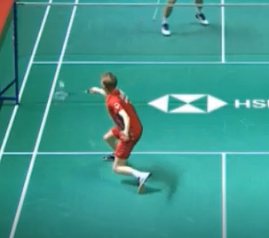
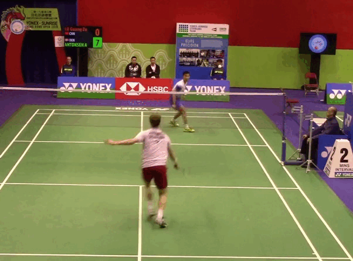

## Welcome to my website
This website seeks to stand as support to my thesis Few-Shot Action Recognition for BadmintonStroke Classification. On the website I will show different data examples and model results. It should be seen as a tool for better visualizing the findigs as presenting video data in a paper information can quickly be lost.

## Data Presentation

I will give a quick overview of the data content used in this work. I annotated three different matches. A short clip from each match is presented below

<p float="left">
  <video src="Chen_video_1_clip.mp4" width="250" height="250" controls preload></video>
  <video src="nish_vinc_point_1.mp4" width="250" height="250" controls preload></video>
  <video src="video_test.mp4" width="250" height="250" controls preload></video>
</p>

### Video Crop Types
In the thesis I seek to investigate two different video crop types: Half-field crop and Player-crop. 

#### Half-field crop


## Results

### Chen Axel 9_7 

### without
<p float="left">
  <video src="Chen_Axel_9_7_1_without.mp4" width="320" height="200" controls preload></video>
  <video src="Chen_Axel_9_7_2_without.mp4" width="320" height="200" controls preload></video>
</p>

### With
<video src="Chen_Axel_9_7_1_with.mp4" width="320" height="200" controls preload></video>

<p float="left">
  <video src="Chen_Axel_9_7_1_with.mp4" width="320" height="200" controls preload></video>
  <video src="Chen_Axel_9_7_2_with.mp4" width="320" height="200" controls preload></video>
</p>

### Nish Vinc 3_2

### Without

<p float="left">
  <video src="Nish_Vinc_3_2_1_without.mp4" width="320" height="200" controls preload></video>
  <video src="Nish_Vinc_3_2_2_without.mp4" width="320" height="200" controls preload></video>
</p>

### With


<p float="left">
  <video src="Nish_Vinc_3_2_with.mp4" width="320" height="200" controls preload></video>
  <video src="Nish_Vinc_3_2_2_with.mp4" width="320" height="200" controls preload></video>
</p>


**Bold** and _Italic_ and `Code` text

[Link](url) and 
```
 and 
For more details see [GitHub Flavored Markdown](https://guides.github.com/features/mastering-markdown/).

<video src="video_test.mp4" width="320" height="200" controls preload></video> and 

<video src="video_test.mp4" width="320" height="200" controls preload></video>

<details>
    <summary>Minhas Estátisticas no Github</summary>
    <p>
        <video align="left" src="video_test.mp4" width="320" height="200" controls preload></video>
                      
        <video align="right" src="video_test.mp4" width="320" height="200" controls preload></video>
    </p>
</details>



<p float="left">
  
  
  
</p>

<p float="left">
  <video src="video_test.mp4" width="250" height="250" controls preload></video>
  <video src="video_test.mp4" width="250" height="250" controls preload></video>
  <video src="video_test.mp4" width="250" height="250" controls preload></video>
</p>


### Jekyll Themes

Your Pages site will use the layout and styles from the Jekyll theme you have selected in your [repository settings](https://github.com/s153242/Badminton_Few_shot_learning.github.io/settings/pages). The name of this theme is saved in the Jekyll `_config.yml` configuration file.

### Support or Contact

Having trouble with Pages? Check out our [documentation](https://docs.github.com/categories/github-pages-basics/) or [contact support](https://support.github.com/contact) and we’ll help you sort it out.
